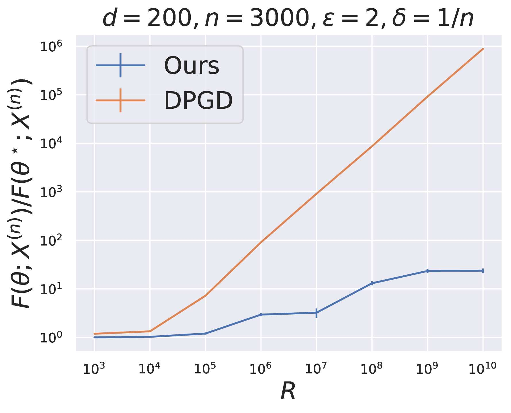
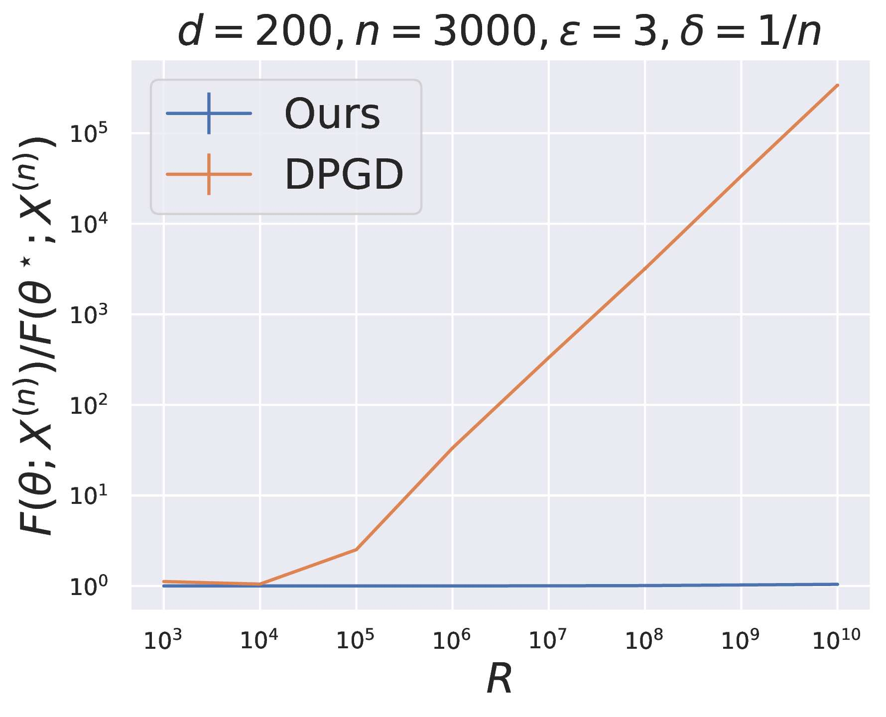

# Private Geometric Median

Official implementation of **"Private Geometric Median"** presented at NeurIPS 2024.

**Authors:** Mahdi Haghifam, Thomas Steinke, Jonathan Ullman

## Abstract

This repository contains the implementation of differentially private (DP) algorithms for computing the geometric median of a dataset. Given $n$ points $x_1, \ldots, x_n \in \mathbb{R}^d$, our goal is to find a point $\theta$ that minimizes the sum of Euclidean distances to these points while preserving privacy.

Unlike standard approaches like DP-GD that require strong a priori knowledge about data location within a ball of radius $R$ (with excess risk depending linearly on $R$), our algorithms provide excess error guarantees that scale with the **effective diameter** of the datapoints—the unknown radius containing the majority of the data.

|  |  |

## Contact

For questions and feedback:
- **Mahdi Haghifam** - [haghifam.mahdi@gmail.com](mailto:haghifam.mahdi@gmail.com)

---

**Note:** This is research code. While we have tested it thoroughly, it may contain bugs. Please report any issues you encounter.
